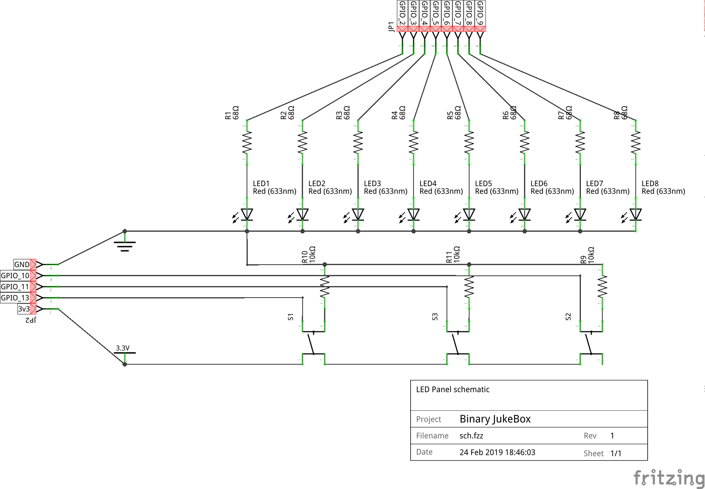

---
# Front Matter
# Title of your project used for the breadcrumb title and meta title.
title:  Binary JukeBox

# Permalink your project will reside under on the 96boards.org website.
# separate your title's words with dashes for SEO purposes.
permalink: /projects/binary-jukebox/
author: Sahaj Sarup 

# Add a description of your project
description: A Juke-Box like setup. but instead of selecting a song using decimal numbers the user punches in digits in binary!

# Add the names of your images which are stored in the sub folders here.
# The first image is always used in the table at /projects/
# This section is used to add a social media share image to your project.
# Place the image you'd like to use when sharing on social media in the /assets/images/projects/
# folder and adjust the following YAML accordingly.
# High Res 1920 x 1080
# regenerated on site build
#image: 
#    path: /assets/images/projects/share_image.png
#    list:
#        - thumb.png
#        - share.png
#social:
#  name: 96Boards
#  links:
#    - https://twitter.com/96boards
#    - https://www.facebook.com/96Boards/
#    - https://www.linkedin.com/company/96boards/
#    - https://plus.google.com/+96Boards
#    - https://github.com/96boards
project:
    # Difficulty level for your project <Beginner, Intermediate, Experienced>
    difficulty_level:
     - Experienced
    # Boards that you have used in this project. For a full list of boards see 
    # this file in the 96boards/website repo - _data/boards.yml
    boards_used: 
      - dragonboard410c
    # Verticals are catagories that your project belongs to. For a full list of verticals see 
    # this file in the 96boards/website repo - _data/verticles.yml
    verticals:
      - Maker
#Optional tags for your projects: meta-key words
tags:
- jukebox
- fpga
- dragonboard
- binary
---

# Binary JukeBox

A Juke-Box like setup. but instead of selecting a song using decimal numbers the user punches in digits in binary!

# Table of Contents

- [1) Hardware](#1-hardware)
   - [1.1) Hardware Requirements](#11-hardware-requirements)
   - [1.2) Hardware Setup](#12-hardware-setup)
- [2) Software](#2-software)
   - [2.1) Install Dependencies](#21-install-dependencies)
   - [2.2) Compiling and Running the Code](#23-compiling-and-running-the-code)

# 1) Hardware

## 1.1) Hardware Requirements

- [DragonBoard 410c](https://www.96boards.org/product/dragonboard410c/)
- [Shiratech FPGA Mezzanine](https://www.96boards.org/product/shiratech-fpga/)
- [8x LEDs](https://www.arrow.com/en/products/lth3mm12vfr4100/visual-communications)
- [8x 68 Ohm Resistors](https://www.arrow.com/en/products/cf14jt68r0/stackpole-electronics)
- [3x Push buttons](https://www.arrow.com/en/products/b3w-4050s/omron)
- [3x 10K Ohm Resistors](https://www.arrow.com/en/products/ccf0710k0jke36/vishay)
- [1x Stereo HEadphone Jack](https://www.arrow.com/en/products/1699/adafruit-industries)

## 1.2) Hardware Setup

- Make sure that the FPGA Mezzanine is properly connected to the DragonBoard 410c.
- Follow this diagram to connect the LED Control panel to the FPGA Mezzanine's Arduino header


- [Attach a headphone jack to the audio header.](https://developer.qualcomm.com/download/db410c/stereo-connector-and-audio-routing-application-note.pdf)


# 2) Software

- **[Install MRAA on 96Boards CE](https://youtu.be/c8b6pcc6H2c)**
- Update Submodules: `git submodule update --recursive --init`

## 2.1) Install Dependencies

```shell
$ sudo apt install libvlc-dev libncurses5-dev
```

## 2.2) Comipling and Running the Code

- **Add music Library**
  - Create a folder called `music` in the project's root directory and add upto 255 tracks.
    > Note: The file names should just be the Name of the Track followed by the Artist.
- **Compile:**
  - Simply run `make` at the project's root directory.
- **Run**
  - `$ sudo ./binjukebox`
  - You should see all the 255 tracks being listed.
  - The first track will start to play.
  - The current playing track gets highlighted.
  - Use Button 1 and Button two to Left shift a 1 or a 0 bit to make a song selection.
  - Button 3 plays the selected song.
  - If no song is selected the player would automatically play the next song.
